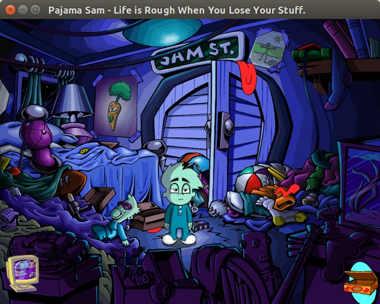

# linyaga

Wrapper for [Humongous Entertainment](https://www.mobygames.com/company/humongous-entertainment-inc) games based on the Yaga engine.

* [Pajama Sam: Life is Rough When You Lose Your Stuff](https://www.mobygames.com/game/pajama-sam-life-is-rough-when-you-lose-your-stuff)
* [Putt-Putt: Pep's Birthday Surprise](https://www.mobygames.com/game/putt-putt-peps-birthday-surprise)




## Running

The original game data files (.he, .da2) are required.

```
DATAPATH=path/to/datafiles ./yagaboot path/to/PajamaLRS.exe -?
```

If the `DATAPATH` environment variable is not set, data files should be copied to the current directory.


## Compiling

The code depends on [dr_libs](https://github.com/mackron/dr_libs), [FFmpeg](https://www.ffmpeg.org/), [Python 2.2.1](https://www.python.org/downloads/release/python-221/), [SDL2](https://libsdl.org/) and [zlib](https://zlib.net/).


## Missing Features

* Lipsync
